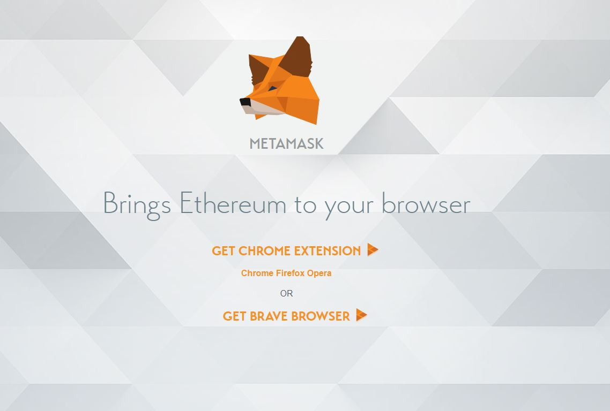
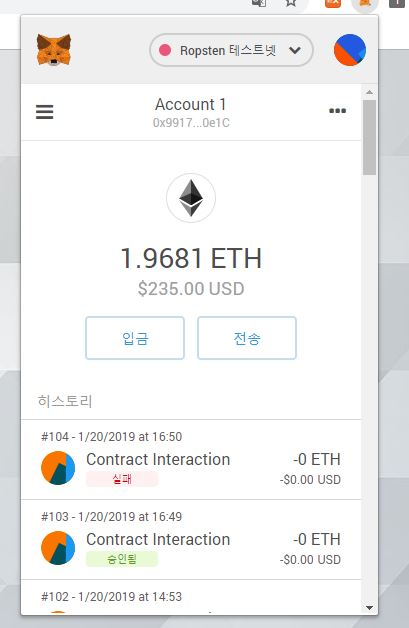
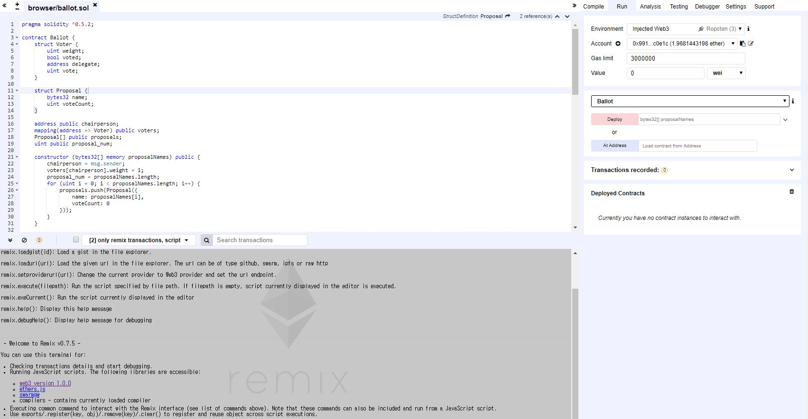
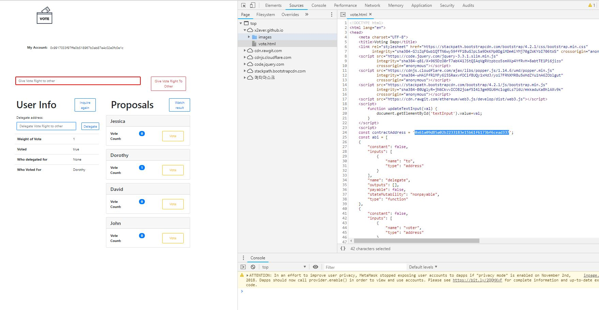
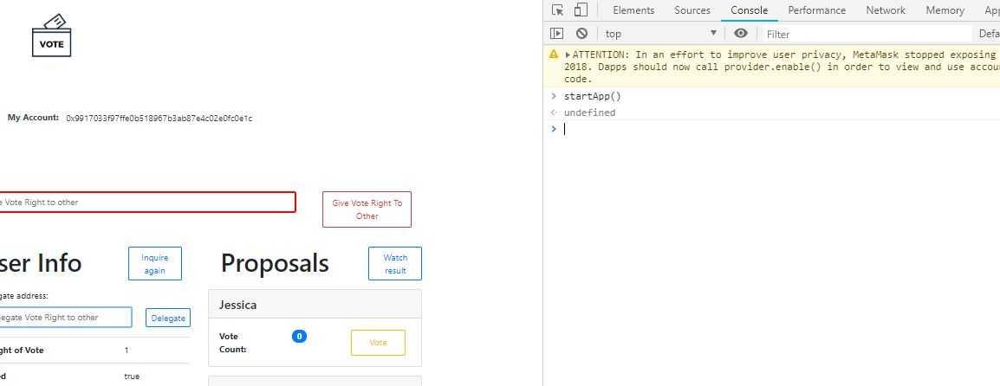

# Simple-dApp

## How to use?

### Just for watching

1.Install [Metamask](https://metamask.io/) with Chrome extension.

<figure>
	<a href="https://metamask.io/"></a>
</figure>


2.Login to Metamask. And set a network as a ropsten testnet.

<figure>
	<a href="https://metamask.io/"></a>
</figure>


3.And open vote.html. [Click here!](https://x2ever.github.io/vote.html)


### Make your own vote.


4.Compile and Deploy from [Remix](https://remix.ethereum.org/) with this [Source](https://gist.github.com/x2ever/bbbfc522df6787291c0b2814d73fc581#file-ballot_0-5-2-sol).

<figure>
	<a href="https://metamask.io/"></a>
</figure>


```java
pragma solidity ^0.5.2;

contract Ballot {
    struct Voter {
        uint weight;
        bool voted;
        address delegate;
        uint vote;
    }

    struct Proposal {
        bytes32 name;
        uint voteCount;
    }

    address public chairperson;
    mapping(address => Voter) public voters;
    Proposal[] public proposals;
    uint public proposal_num;

    constructor (bytes32[] memory proposalNames) public {
        chairperson = msg.sender;
        voters[chairperson].weight = 1;
        proposal_num = proposalNames.length;
        for (uint i = 0; i < proposalNames.length; i++) {
            proposals.push(Proposal({
                name: proposalNames[i],
                voteCount: 0
            }));
        }
    }
    
    function voterInfo() public view returns(uint, bool, address, uint){
        return (voters[msg.sender].weight, voters[msg.sender].voted, voters[msg.sender].delegate, voters[msg.sender].vote);
    }

    function giveRightToVote(address voter) public {
        require(
            (msg.sender == chairperson) &&
            !voters[voter].voted &&
            (voters[voter].weight == 0)
        );
        voters[voter].weight = 1;
    }

    function delegate(address to) public {
        Voter storage sender = voters[msg.sender];
        require(!sender.voted);

        require(to != msg.sender);
        
        while (voters[to].delegate != address(0)) {
            to = voters[to].delegate;

            require(to != msg.sender);
        }

        sender.voted = true;
        sender.delegate = to;
        Voter storage delegate_ = voters[to];
        if (delegate_.voted) {
            proposals[delegate_.vote].voteCount += sender.weight;
        } else {
            delegate_.weight += sender.weight;
        }
    }
    
    function vote(uint proposal) public {
        Voter storage sender = voters[msg.sender];
        require(!sender.voted);
        sender.voted = true;
        sender.vote = proposal;
        
        proposals[proposal].voteCount += sender.weight;
    }
    
    function winningProposal() public view
            returns (uint winningProposal_)
    {
        uint winningVoteCount = 0;
        for (uint p = 0; p < proposals.length; p++) {
            if (proposals[p].voteCount > winningVoteCount) {
                winningVoteCount = proposals[p].voteCount;
                winningProposal_ = p;
            }
        }
    }

    function winnerName() public view
            returns (bytes32 winnerName_)
    {
        winnerName_ = proposals[winningProposal()].name;
    }
}
```


5.From step 4, You can get address of delpoyed contract. Copy and paste in here.

<figure>
	<a href="https://x2ever.github.io/vote.html"></a>
</figure>


6.Open console and Enter a command 'startApp()'.

<figure>
	<a href="https://x2ever.github.io/vote.html"></a>
</figure>


## How to make dapp?

<p>If you can't make your own dApp with above step, just follow me.</p>
<p>I'm posting a making dApp series in my [blog](https://x2ever.github.io/).</p>


## Preview

### Header

We can check if my wallat is active or not. If users login to metamsak normally, users can see their address.

<figure>
	<a href="https://x2ever.github.io//vote.html"></a>
</figure>

### For Admin

If you are admin of this vote, you can give right to vote to others.

<figure>
	<a href="https://x2ever.github.io//vote.html"></a>
</figure>

### Alert message 1

While using blockchain, we should wait for transactions to be included in the blockchain. A alert message can help users understand the progress of the transaction.

<figure>
	<a href="https://x2ever.github.io//vote.html"></a>
</figure>

### Alert message 2

While using Smart contract, Some transactions are reverted. This alert message can also help users understand the progress of the transaction.

<figure>
	<a href="https://x2ever.github.io//vote.html"></a>
</figure>

### User Information

Check User Informations. And Use delegate function with easy UI.

<figure>
	<a href="https://x2ever.github.io//vote.html"></a>
</figure>

### Proposal list

See propsal list. And User vote function with easy UI.

<figure>
	<a href="https://x2ever.github.io//vote.html"></a>
</figure>

### Result

At the end of this series, you can complete the following vote dapp. The source code can be found [here](https://github.com/x2ever/x2ever.github.io/vote.html).

<figure>
	<a href="https://x2ever.github.io//vote.html"></a>
</figure>
